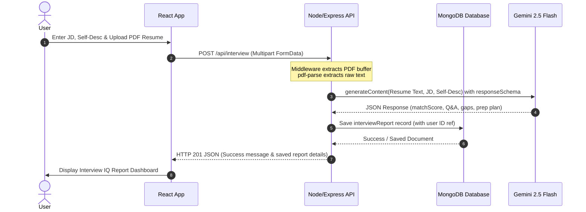

# Product Requirements Document (PRD)
## Project Name: InterviewIQ (AI-Powered Interview Prep Assistant)

| Field | Detail |
| :--- | :--- |
| **Document Version** | 1.0.0 |
| **Last Updated** | July 18, 2026 |
| **Status** | Initial Draft |
| **Author** | Antigravity AI Assistant |

---

## 1. Executive Summary
InterviewIQ is a web application designed to help job seekers prepare for interviews by matching their credentials and experiences against specific job descriptions. By utilizing state-of-the-art Generative AI, the platform parses resumes and self-descriptions, checks them against job descriptions, and returns comprehensive, actionable, and structured interview preparation insights.

---

## 2. Objectives & Success Metrics
### 2.1 Objectives
- **Empower Candidates**: Provide candidates with high-quality, personalized mock questions, intention analysis, and model answers.
- **Identify Preparation Gaps**: Detail skill discrepancies with varying severity levels to focus candidate study time.
- **Roadmap Preparation**: Offer a clear, chronological day-by-day plan of tasks to address weak areas.

### 2.2 Success Metrics
- **Analysis Accuracy**: High relevance of generated questions compared to real-world job description requirements.
- **Engagement**: Percentage of users who generate multiple reports for different job descriptions.
- **Performance**: Report generation time of under 10 seconds.

---

## 3. Target Audience & User Personas
- **Job Seekers / Active Candidates**: Professionals looking to brush up on their skills, align their experience with a specific job posting, and run practice interview sessions.
- **Career Switchers**: Individuals moving into a new domain who need guidance on what technical/behavioral expectations the interviewer will have.

---

## 4. Product Scope & Functional Requirements

### 4.1 Authentication & Authorization (Auth)
The system requires users to authenticate to save and retrieve their custom preparation plans.

| Feature ID | Feature Name | Description | Status |
| :--- | :--- | :--- | :--- |
| **REQ-AUTH-01** | User Registration | Users register using a unique `username`, `email`, and secure `password`. | Implemented |
| **REQ-AUTH-02** | User Login | Users log in using `email` and `password`. Sets a secure HTTP-Only JWT cookie. | Implemented |
| **REQ-AUTH-03** | User Logout | Users log out. The session token is cleared from the cookies and added to a blacklist database to prevent token replay attacks. | Implemented |
| **REQ-AUTH-04** | Protected Routes | Route protection middleware blocks unauthenticated users from generating reports or accessing custom prep materials. | Implemented |

### 4.2 Interview Report Generation Engine
The core feature of the application analyzes inputs to produce customized preparation plans.

| Feature ID | Feature Name | Description | Status |
| :--- | :--- | :--- | :--- |
| **REQ-REP-01** | Resume Upload | Support for uploading resumes in `.pdf` format (max size limit of 3MB). System parses text contents out of the PDF on-the-fly. | Implemented |
| **REQ-REP-02** | Job Description Input | A textarea field allowing users to paste full job description details. | Implemented |
| **REQ-REP-03** | Self Description Input | A textarea field for users to write a brief summary of their career objectives, soft skills, or extra context not listed on their resume. | Implemented |
| **REQ-REP-04** | AI Matching Engine | Leverages the `gemini-2.5-flash` model with Google Gen AI SDK to run matching analysis. | Implemented |
| **REQ-REP-05** | Persistent Reports | Saved to MongoDB associated with the logged-in user profile, enabling historical dashboard recall. | Implemented |

### 4.3 Data Schema & Report Structure
Every generated interview report enforces a strict JSON schema via Gemini's `responseSchema` configuration:

```json
{
  "matchScore": "Integer (0 to 100 representing job matching level)",
  "technicalQuestions": [
    {
      "question": "Proposed technical question",
      "intention": "Intention of the interviewer",
      "answer": "Suggested response/answering strategy"
    }
  ],
  "behavioralQuestions": [
    {
      "question": "Proposed behavioral question",
      "intention": "Intention of the interviewer",
      "answer": "Suggested response/answering strategy"
    }
  ],
  "skillGaps": [
    {
      "skill": "Missing or weak skill",
      "severity": "low | medium | high"
    }
  ],
  "preparationPlan": [
    {
      "day": "Day number (integer)",
      "focus": "Preparation focus area",
      "tasks": ["Task description string"]
    }
  ]
}
```

---

## 5. System Architecture & Tech Stack

### 5.1 Tech Stack
- **Frontend**: React (Vite-based build), React Router v7 (configured via router paths), SCSS, Axios.
- **Backend**: Node.js, Express.js, JWT Cookie Authentication, blacklist tracking for logout tokens.
- **Database**: MongoDB & Mongoose.
- **AI Core**: Google Gen AI SDK (`@google/genai`) using the `gemini-2.5-flash` model.
- **Utility**: `pdf-parse` for extract-to-text operations on resume uploads.

### 5.2 Design Prototypes
- **Stitch AI Mockups**: Interactive designs, CSS templates, and mock screens are generated in the `stitch_ai_interview_preparation_assistant/` directory. These assets are excluded from Git version control (ignored in `.gitignore`) to prevent repository bloat while keeping them accessible locally for visual and style guides.

### 5.3 Architecture Sequence Diagram



---

## 6. Detailed UX/UI Requirements & User Flow
1. **Landing/Authentication Page**:
   - Simplistic registration/login page.
   - Restricts homepage access until authenticated.
2. **Dashboard / Analysis Form**:
   - split layout:
     - **Left Side**: Job description entry area.
     - **Right Side**: Resume file upload selector and Self Description textarea.
     - **Action**: "Generate Interview Report" CTA trigger button.
3. **Report Presentation Page** *(Implemented)*:
   - Visual breakdown of the **Match Score** using an animated circle/radial progress bar.
   - Expandable accordion sections for **Technical Questions** and **Behavioral Questions** detailing the *Question*, *Intention*, and *Suggested Answer*.
   - A prioritized badge-based list of **Skill Gaps** colored by severity (Red for High, Yellow for Medium, Green for Low).
   - An interactive timeline displaying the **Day-by-Day Preparation Plan**.

---

## 7. Current Code Issues & Recommendations

During our examination of the codebase, we identified a few issues that should be resolved before deployment:

> [!WARNING]
> **Missing Import in React Router Config**:
> In [app.routes.jsx](file:///c:/Users/KUMAR%20ADITYA/OneDrive/Desktop/MY%20PROJECTS/InterviewIQ/Frontend/src/app.routes.jsx), the `Home` component is defined on line 11 as `<Home/>` inside the protected route, but there is no import statement. This causes a frontend compiler/runtime error.
> 
> *Recommended Fix*: Add `import Home from "./features/interview/pages/Home";` at the top of the file.

> [!IMPORTANT]
> **Lack of Report Viewing UI on the Frontend**:
> While the Backend controller correctly generates and returns the report JSON, and saves it in MongoDB, the current frontend [Home.jsx](file:///c:/Users/KUMAR%20ADITYA/OneDrive/Desktop/MY%20PROJECTS/InterviewIQ/Frontend/src/features/interview/pages/Home.jsx) only contains input forms and lacks any rendering container or loading/success state handler for displaying the finished reports.
> 
> *Recommended Fix*: Implement React state in `Home.jsx` to fetch the response from the API and display it using stylized UI cards, accordion folders, and a day-by-day roadmap timeline.

---

## 8. Future Roadmap & Enhancement Backlog
1. **Interactive Mock Interviews**: Enable audio/text conversational mock interviews where candidates can answer AI-generated questions directly, receiving instant evaluation.
2. **Resume Optimizer**: Suggest changes directly on the parsed resume text to help the candidate rank higher for the targeted job description.
3. **Historic Reports Dashboard**: Allow users to browse their previous reports and preparation plans from a dedicated history tab.
