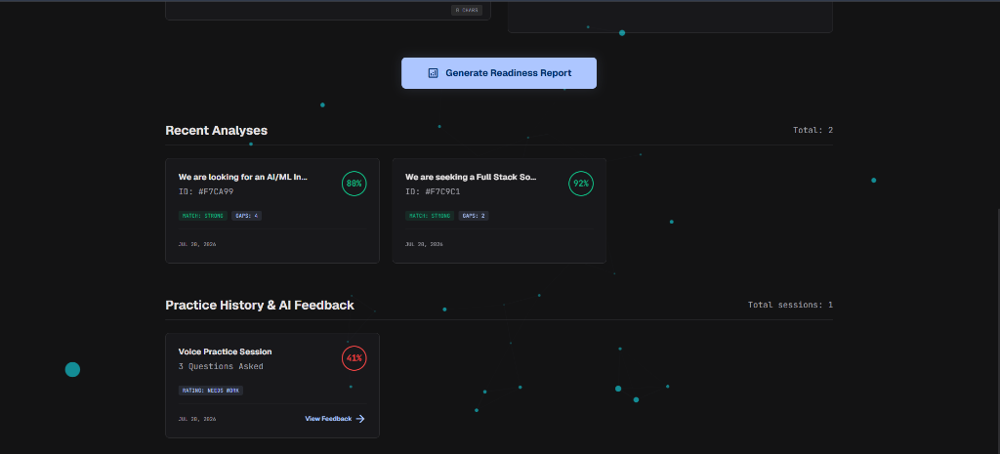
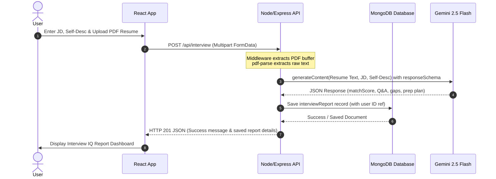

# InterviewIQ 🚀

InterviewIQ is a premium, AI-powered diagnostic and preparation platform built for high-stakes technical candidates. By combining **React, Node.js (Express), MongoDB**, and the **Google Gemini API**, InterviewIQ enables job seekers to analyze their profiles against target job descriptions, undergo conversational speech simulation with live analytical feedback, and compile print-perfect Serif LaTeX resumes.

---

## 📸 Platform Walkthrough & Features

### 1. Unified Candidate Dashboard
Access historical readiness profiles, browse past scorecards, and review your practice session feedback. The dashboard serves as a candidate command center.
*   **Resume Parse & Match**: Upload standard PDF resumes to extract text context.
*   **Job & Self-Objective Alignment**: Compare credentials alongside career objectives against target role descriptions.
*   **Readiness History**: Access a historic chronological feed of previous reports.



---

### 2. Deep Match Diagnostics & 7-Day Roadmap
Understand how you rank against the job description with visual scoring metrics, detailed questions guides, and a complete study plan.
*   **Technical & Behavioral Accordions**: Gain visibility into the interviewer's intent and review recommended answering strategies.
*   **Severity-Scaled Skill Gaps**: Highlights key discrepancies between your experience and target role requirements (High/Medium/Low priority).
*   **Interactive 7-Day Roadmap**: Shows a chronological timeline. Each day box is interactive; clicking a block opens a pop-up modal on the same page showing full task descriptions.


---

### 3. Interactive Speech Simulator
Practice real-time technical rounds with a conversational AI agent using voice or text inputs.
*   **Real-time WPM Pacing**: An active timer tracks your typing/speaking rate dynamically to make sure you stay in the optimal 120-160 WPM communication range.
*   **STAR Structure Detector**: Analyzes your response text for Situation, Task, Action, and Result indicators in real-time, displaying structural progress bars.
*   **Dynamic Keyword Tracker**: Dynamically loads relevant vocabulary terms based on the question topic (Technical Architecture vs. Team Alignment) and lights them up as you use them.
*   **Live Match Score**: Computes your performance score out of 100 on the fly.


---

### 4. ATS Serif LaTeX Resume Builder
Rewrite, structure, and optimize your resume's achievements to align directly with target keywords using AI, keeping layouts clean and clean.
*   **Gemini Bullet Enhancer**: Refactors job bullet points to include action verbs and relevant technical terms.
*   **Enforced One-Page A4 Budget**: The builder interface restricts page length constraints, avoiding overflow.
*   **Integrated PDF Compiler**: Edit, compile, preview, and print clean Serif LaTeX documents instantly.


---

## 🏗️ Technical Architecture & Monorepo

### Architecture Sequence


### Folder Layout
*   **`Backend/`**: Node.js & Express API services. Manages user authentication sessions, JWT validations, PDF text parses (`pdf-parse`), and Google Gen AI API prompt orchestrations.
*   **`Frontend/`**: React application bundled using Vite. Features theme-driven styling (Vanilla CSS + HSL design variables), robust routes (`react-router` v7), and continuous speech transcription handles.
*   **`screenshots/`**: Directory containing assets for documentation and walkthroughs.

---

## 🔒 Security Standards

1.  **Strict Request Schema Validation**: Every API endpoint validates fields (checking types, lengths, and exact formats) before processing requests, preventing code injections and parameter tampering.
2.  **Isolated Storage & File Uploads**: Uploaded files undergo MIME-type checks and are stored with randomized names outside the web-root directory, making it impossible to upload executable scripts.
3.  **Generic Client Errors**: Clients never receive raw database errors, stack traces, or server directory locations. The server logs comprehensive traces internally while responding with generic, user-safe error messages.
4.  **Zero Hardcoded Keys**: The system relies on secure environmental variables (`.env`) for secrets, such as Mongo connection URIs, JWT signing tokens, and Google API keys.

---

## ⚙️ Local Setup

### Setup Requirements
*   Node.js (v18+)
*   MongoDB Local/Cloud instance
*   Google Gen AI (Gemini) API Key

### Step 1: Run the Backend Server
1.  Navigate to the `Backend` directory:
    ```bash
    cd Backend
    ```
2.  Install packages:
    ```bash
    npm install
    ```
3.  Create a `.env` file in the root of the `Backend/` folder:
    ```env
    PORT=5000
    MONGO_URI=mongodb://localhost:27017/interviewiq
    JWT_SECRET=your_jwt_secret_token_here
    GEMINI_API_KEY=your_gemini_api_key_here
    ```
4.  Start development server:
    ```bash
    npm run dev
    ```

### Step 2: Run the Frontend App
1.  Navigate to the `Frontend` directory:
    ```bash
    cd ../Frontend
    ```
2.  Install packages:
    ```bash
    npm install
    ```
3.  Create a `.env` file in the root of the `Frontend/` folder:
    ```env
    VITE_API_URL=http://localhost:5000/api
    ```
4.  Start development server:
    ```bash
    npm run dev
    ```
5.  Open your browser and navigate to `http://localhost:5173`.
