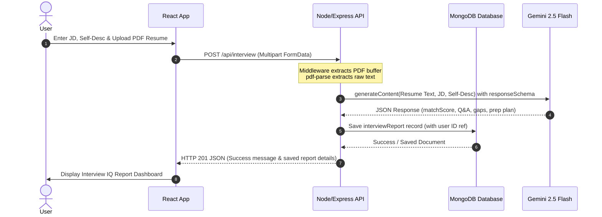

# InterviewIQ

InterviewIQ is an enterprise-grade technical interview diagnostic and mock preparation platform. Built using a modern technical stack comprising React, Node.js (Express), MongoDB, and the Google Gemini API, the platform enables software engineering candidates to analyze their credentials against targeted roles, run speech-based mock practice sessions with real-time analytics, and build optimized Serif LaTeX resumes.

---

## Key Modules and Feature Specifications

### 1. Match Diagnostic Engine
The system parses and evaluates candidate profiles against targeted job openings using deep semantic matching.
*   **Resume Extraction**: Automatically parses uploaded PDF resume contents on the fly.
*   **Semantic Matching**: Computes match percentages comparing skills, experience levels, and objectives against target role responsibilities.
*   **Prioritized Skill Gaps**: Categorizes missing qualifications into critical severity tiers (High, Medium, Low) to help focus preparation efforts.
*   **Historical Archive**: Saves prior diagnostic profiles to MongoDB, enabling candidates to track their preparation progress over time.

### 2. Live Speech Simulator and Conversational Analytics
A high-fidelity speech simulator that evaluates responses to technical and behavioral questions in real time.
*   **Real-time Speech Transcription**: Captures voice input continuously using speech synthesis and recognition APIs.
*   **Words-Per-Minute (WPM) Cadence Analysis**: Measures typing and speech pace, providing visual charts indicating if the response is within the ideal 120-160 WPM verbal communication range.
*   **STAR Structure Detection**: Monitors transcripts for semantic structural anchors representing Situation, Task, Action, and Result formats.
*   **Dynamic Vocabulary Checklists**: Dynamically updates target terms and architectural keywords based on the active question topic, highlighting them in real-time as the candidate states them.

### 3. ATS-Optimized Serif LaTeX Resume Optimizer
A compiler environment designed to optimize resume achievements and formatting to align with the target role.
*   **Bullet Point Optimization**: Uses AI recommendations to structure bullets using strong action verbs and relevant domain keywords.
*   **Single-Page Layout Enforcer**: Enforces strict layout budgeting to prevent page overflow, ensuring the compiled output fits standard one-page specifications.
*   **Integrated Preview Compiler**: Provides a real-time print view of the tailored Serif LaTeX document.

### 4. Interactive 7-Day Preparation Roadmap
Builds an customized, step-by-step study timeline based on the candidate's diagnostic report.
*   **Chronological Milestones**: Outlines focus areas for technical and behavioral preparation over a 7-day loop.
*   **Clickable Task Detail Modals**: Every card in the roadmap timeline is interactive; clicking it opens a pop-up details modal displaying structured tasks and target milestones on the same page.

---

## Video Demonstration

A complete product walkthrough demonstrating the core workflows, including report generation, mock speech practice, and LaTeX resume compilation, can be found here:

[Watch the Demonstration Video](https://link-to-your-video-walkthrough.com)

---

## Technical Architecture

### System Sequence Flow


### Folder Layout
*   **`Backend/`**: Express server handling API routing, security middleware, JWT authentication, PDF text extraction, and Gen AI prompt execution.
*   **`Frontend/`**: Vite-bundled React frontend application featuring structured routing, styling variables, and speech recognition transcription hooks.

---

## Security and Robustness

*   **Request Schema Validation**: All API request bodies undergo strict validation for type and length constraints to prevent parameter tampering.
*   **Isolated Storage**: Uploaded PDF files are stored with randomized identifiers outside the public web root directory.
*   **Error Concealment**: Suppresses runtime server stack traces and database internal information in client responses, returning clean generic error summaries while logging diagnostic traces securely server-side.
*   **Secure Environment Configurations**: Relies exclusively on environmental variable injection (`.env`) for storing API keys and JWT signature secrets.

---

## Local Setup

### System Prerequisites
*   Node.js (v18+)
*   MongoDB Instance
*   Google Gemini API Key

### 1. Server Configuration
1.  Navigate to the server directory:
    ```bash
    cd Backend
    ```
2.  Install packages:
    ```bash
    npm install
    ```
3.  Create a `.env` file in the root of the server directory:
    ```env
    PORT=5000
    MONGO_URI=mongodb://localhost:27017/interviewiq
    JWT_SECRET=your_jwt_secret_token_here
    GEMINI_API_KEY=your_gemini_api_key_here
    ```
4.  Start server:
    ```bash
    npm run dev
    ```

### 2. Client Configuration
1.  Navigate to the client directory:
    ```bash
    cd ../Frontend
    ```
2.  Install packages:
    ```bash
    npm install
    ```
3.  Create a `.env` file in the root of the client directory:
    ```env
    VITE_API_URL=http://localhost:5000/api
    ```
4.  Start server:
    ```bash
    npm run dev
    ```
5.  Open `http://localhost:5173` in your browser.
