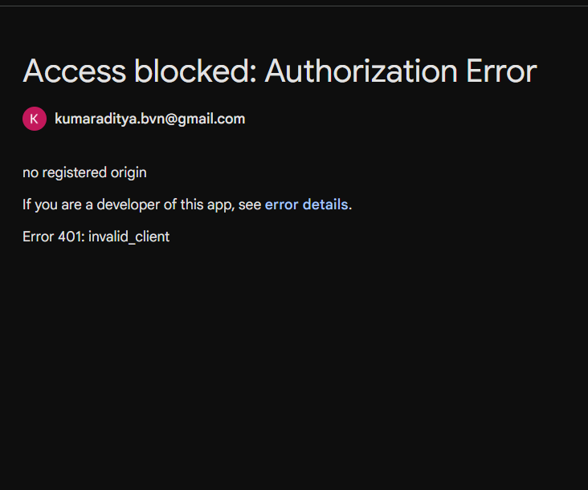
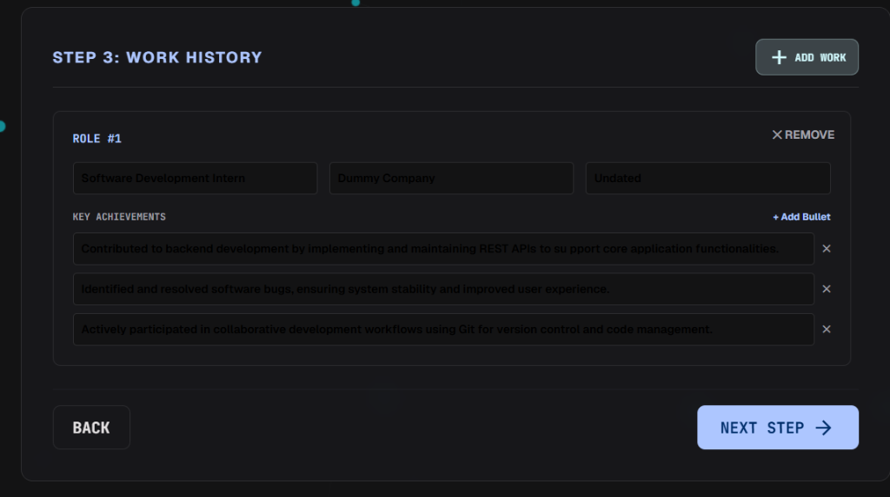
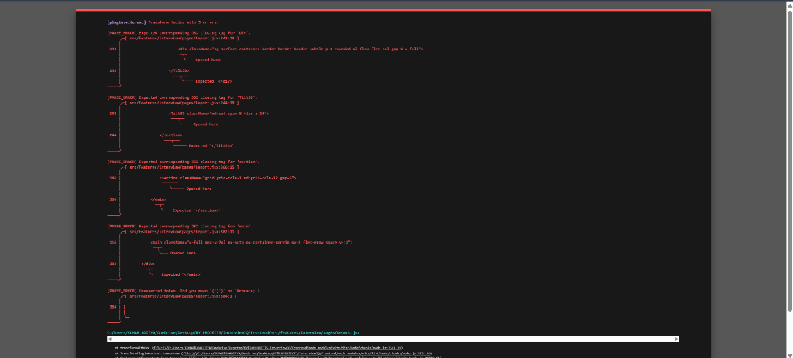
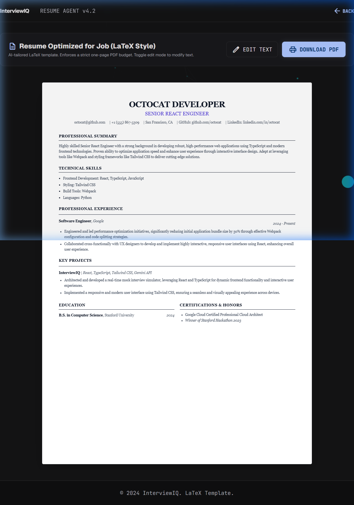

# InterviewIQ 🚀

An elite-tier, AI-powered diagnostic and preparation platform designed for high-stakes technical candidates. Built using **React, Tailwind CSS, Node.js (Express), MongoDB**, and powered by the **Google Gemini API**, InterviewIQ enables candidates to compare credentials against target roles, simulate conversational technical rounds with real-time feedback, and compile publication-quality Serif LaTeX resumes.

---

## 📸 Platform Walkthrough

### 1. Landing & Authentication Page
A premium landing page introducing the candidate to the core value proposition and outlining the 3-step preparation loop before authentication.


### 2. Candidate Dashboard
Enter the target job description and upload your resume to generate a comprehensive AI readiness profile, or access historical reports.


### 3. Readiness Report & 7-Day Roadmap
Understand semantic alignment, technical gaps, and behavioral readiness. Click on any block in the system-generated **Readiness Roadmap** to display daily task popups.



### 4. Interactive Speech Simulator
Simulate conversational technical rounds. Speak or type your responses to receive live, real-time WPM pacing calculations, dynamic keyword check tags, and STAR structure indicators.


### 5. ATS Serif LaTeX Resume Builder
Rewrite and optimize bullet points using Gemini, ensuring action verbs and keywords match the target role while budgeting space to fit a standard one-page A4 print layout.



---

## ⚡ Core Features

*   **AI Match Diagnostics**: Deep semantic matching comparing candidate resume against target role descriptions.
*   **Speech Simulation**: Real-time, continuous microphone speech-to-text transcript scoring WPM, STAR method, and topic relevance.
*   **Serif LaTeX Engine**: Tailors credentials and compiles print-perfect LaTeX resumes enforcing A4 layouts.
*   **7-Day Roadmap**: High-fidelity timeline breakdown showing step-by-step goals for interview prep.
*   **Dynamic Keyword Tracking**: Pivot target tags based on the question topic (Technical vs. Behavioral).

---

## 🏗️ Technical Architecture

### Tech Stack
*   **Frontend**: React (v18), React Router (v7), Vite, Tailwind CSS, HSL Theming, Material Symbols, Glassmorphism design tokens.
*   **Backend**: Node.js (Express), MongoDB (Mongoose), Google Generative AI (`@google/generative-ai`), Multer.

### Monorepo Structure
```bash
InterviewIQ/
├── Backend/                 # Express Server & AI Services
│   ├── src/
│   │   ├── controllers/     # Auth & Interview controllers
│   │   ├── models/          # Mongoose Schemas (User, Report, Practice)
│   │   ├── routes/          # Express API endpoints
│   │   ├── services/        # Gemini AI Prompt Engineering
│   │   └── app.js           # Server Initialization
├── Frontend/                # React UI Applications
│   ├── src/
│   │   ├── features/
│   │   │   ├── auth/        # Login, Register, Profile Pages
│   │   │   └── interview/   # Dashboard, Practice, Resume Builder Pages
│   │   └── main.jsx
├── screenshots/             # Visual screenshots for documentation
└── README.md                # System documentation
```

---

## 🔒 Security & Robustness Standards
*   **Strict Schema Validation**: Implemented rigid type, length, and format validations on all request payloads to prevent security exploits.
*   **Isolated Storage**: Uploaded PDF files are stored outside the web root directory with randomized naming to block code execution.
*   **Generic Error Responses**: Suppresses server stack traces, database schema details, and filesystem locations in client errors, replacing them with generic messages while logging details server-side.
*   **Zero Hardcoded Keys**: Relies entirely on secure environment configurations (`.env`) for JWT secrets and Gemini API keys.

---

## ⚙️ Local Setup

### Prerequisites
*   Node.js (v18+)
*   MongoDB Instance
*   Google Gemini API Key

### 1. Backend Configuration
1. Navigate to the `Backend` directory:
   ```bash
   cd Backend
   ```
2. Install dependencies:
   ```bash
   npm install
   ```
3. Create a `.env` file in the root of `Backend` and add:
   ```env
   PORT=5000
   MONGO_URI=mongodb://localhost:27017/interviewiq
   JWT_SECRET=your_jwt_secret_key_here
   GEMINI_API_KEY=your_gemini_api_key_here
   ```
4. Start the backend developer server:
   ```bash
   npm run dev
   ```

### 2. Frontend Configuration
1. Navigate to the `Frontend` directory:
   ```bash
   cd ../Frontend
   ```
2. Install dependencies:
   ```bash
   npm install
   ```
3. Create a `.env` file in the root of `Frontend` and add:
   ```env
   VITE_API_URL=http://localhost:5000/api
   ```
4. Start the frontend developer server:
   ```bash
   npm run dev
   ```
5. Open your browser and navigate to `http://localhost:5173`.
