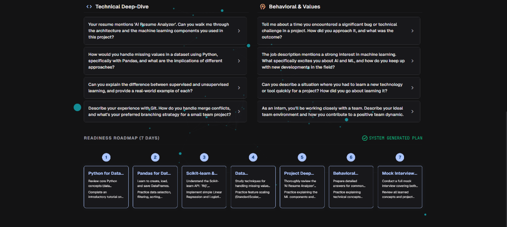
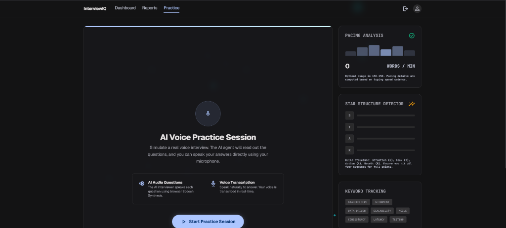

# InterviewIQ 🚀

InterviewIQ is an elite, AI-powered diagnostic and interview preparation platform designed for high-stakes technical candidates. By combining a modern **React frontend (Vite)**, a robust **Node.js (Express) backend**, **MongoDB storage**, and advanced prompt engineering via the **Google Gemini API**, InterviewIQ enables candidates to measure their readiness, run speech simulations, and practice with real-time semantic tracking.

---

## 📸 Platform Features & Sequence Walkthrough

### 🚀 Step 1: Candidate Diagnostic Dashboard
The central command center for candidates. Here, users can start new alignment analyses or access historical profiles.
*   **AI Job-Match Scoring**: View semantic alignment ratings (e.g. 88% Match, 92% Match) compiled for different job descriptions.
*   **Resume Parse**: Extracts technical and behavioral experience out of PDF resume uploads.
*   **Practice History Tracking**: Displays previously completed speech simulator attempts and AI feedback scorecards.


---

### 🗺️ Step 2: Readiness Roadmap & Interactive Q&A Folders
Understand preparation discrepancies and build structured study habits based on customized timelines.
*   **Targeted Question Folders**: Explore technical deep-dive and behavioral questions tailored to the targeted role, complete with interviewer intent breakdowns and suggested STAR answer formulas.
*   **Interactive 7-Day Timeline**: Chronological, system-generated prep plan. Click on any roadmap block to trigger a popup modal with specific task objectives right on the page.



---

### 🎙️ Step 3: Interactive AI Speech Simulator
Simulate realistic technical and behavioral conversational rounds using speech synthesis and recognition.
*   **Pacing & Cadence Analysis**: An active timer monitors word counts to keep responses within the optimal 120-160 WPM communication range.
*   **STAR Structure Indicators**: Detects Situation (S), Task (T), Action (A), and Result (R) markers within response transcripts.
*   **Dynamic Vocabulary Checklist**: Adapts to the interview question topic to verify usage of target terminology.



---

## 🏗️ Technical Architecture & Directory Structure

```bash
InterviewIQ/
├── Backend/                 # Express Server & Gemini Integration
│   ├── src/
│   │   ├── controllers/     # Auth & Interview API handlers
│   │   ├── models/          # MongoDB Schema Models (User, Report, Practice)
│   │   ├── routes/          # API endpoint routes
│   │   ├── services/        # Gemini generative structure prompts
│   │   └── app.js           # Express main engine
├── Frontend/                # React App
│   ├── src/
│   │   ├── features/
│   │   │   ├── auth/        # Login, Register, Profile Pages
│   │   │   └── interview/   # Dashboard, Practice, Reports Pages
│   │   └── main.jsx
├── screenshots/             # Sequence Walkthrough Screenshots
└── README.md                # System Documentation
```

---

## ⚙️ Quick Installation

### Prerequisites
*   Node.js (v18+)
*   Running MongoDB database instance
*   Google Gemini API key

### 1. Server Setup
1.  Navigate to `Backend/` directory and install packages:
    ```bash
    cd Backend
    npm install
    ```
2.  Create a `.env` file in the root of the `Backend/` folder:
    ```env
    PORT=5000
    MONGO_URI=mongodb://localhost:27017/interviewiq
    JWT_SECRET=your_jwt_secret_token_here
    GEMINI_API_KEY=your_gemini_api_key_here
    ```
3.  Start server:
    ```bash
    npm run dev
    ```

### 2. Client Setup
1.  Navigate to `Frontend/` directory and install packages:
    ```bash
    cd ../Frontend
    npm install
    ```
2.  Create a `.env` file in the root of the `Frontend/` folder:
    ```env
    VITE_API_URL=http://localhost:5000/api
    ```
3.  Start server:
    ```bash
    npm run dev
    ```
4.  Open `http://localhost:5173` in your browser.
